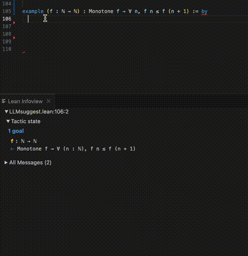

## Part I : Next-step suggestion

Builds a neural next-step suggestion tool, introducing key concepts and overviewing past work in neural theorem proving along the way.



#### Notebooks:
| Topic | Notebook | 
|:-----------------------|-------:|
| 0. Intro            | [notebook](./notebooks/I_nextstep_lean__part0_intro.ipynb) |
| 1. Data             | [notebook](./notebooks/I_nextstep_lean__part1_data.ipynb) |
| 2. Learning         | [notebook](./notebooks/I_nextstep_lean__part2_learn.ipynb) |
| 3. Proof Search     | [notebook](./notebooks/I_nextstep_lean__part3_proofsearch.ipynb) |
| 4. Evaluation       | [notebook](./notebooks/I_nextstep_lean__part4_evaluation.ipynb) |
| 5. `llmsuggest`        | [notebook](./notebooks/I_nextstep_lean__part5_llmsuggest.ipynb) |

All notebooks are in ([`partI_nextstep/notebooks`](./notebooks)). See [`partI_nextstep/ntp_python`](./ntp_python) and [`partI_nextstep/ntp_lean`](./ntp_lean) for the Python and Lean files covered in the notebooks.

## Setup
The notebooks use several tools: Lean (in VSCode), `pylean`, and LeanDojo. It also uses Pytorch and Huggingface for language modeling. Below are setup steps:

### Setup Lean

#### Setup Lean in VS Code
To try the interactive tool, you will need VS Code and Lean 4. 

Please follow the [official instructions for installing Lean 4 in VS Code](https://leanprover-community.github.io/install/macos_details.html#installing-and-configuring-an-editor): [Installing and configuring an editor](https://leanprover-community.github.io/install/macos_details.html#installing-and-configuring-an-editor).


#### Setup Lean on the command line

Additionally, to run the notebooks you will need Lean 4 installed on your laptop/server.

On Linux or in a Colab notebook, run this command:
```
# from https://leanprover-community.github.io/install/linux.html
curl https://raw.githubusercontent.com/leanprover/elan/master/elan-init.sh -sSf | sh
source $HOME/.elan/env
lake
```

For MacOS see:
```
https://leanprover-community.github.io/install/macos.html
```

### Setup [`pylean`](https://github.com/zhangir-azerbayev/repl/tree/master)
The `Proof Search` notebook uses [`pylean`](https://github.com/zhangir-azerbayev/repl/tree/master). 

```bash
git clone 
https://github.com/zhangir-azerbayev/repl
cd repl

git checkout bddf452deda0df2240b248e651bcc37fb8e59d01

cd pylean
python setup.py develop
```

Then add the following to `repl/lakefile.lean`:
```
require mathlib from git
  "https://github.com/leanprover-community/mathlib4.git" @ "38dbcd8285bc4b1391619c12f158a7409f3dfc12"
```


### Setup LeanDojo
If you want to reproduce the evaluation discussed in the `Evaluation` notebook and implemented in `proofsearch_dojo.py`, you will need to install Lean Dojo: 
```
pip install lean-dojo==1.1.2
export CONTAINER="native"
```
The second line is needed to run LeanDojo outside of Docker.

### Setup language modeling tools
The notebooks use `pytorch` and Huggingface `transformers` and `datasets`.
Here is a Conda environment file for an environment that this ran on (excluding the additional libraries above):
```
name: ntp
channels:
  - defaults
dependencies:
  - python==3.10.11
  - pip
  - pip:
    - accelerate==0.21.0
    - datasets==2.13.1
    - huggingface-hub==0.15.1
    - ndjson==0.3.1
    - nest-asyncio==1.5.6
    - networkx==3.1
    - nh3==0.2.14
    - ninja==1.11.1
    - numpy==1.25.0
    - torch==2.0.1
    - tqdm==4.65.0
    - transformers==4.31.0
prefix: /home/seanw/.conda/envs/ntp
```
